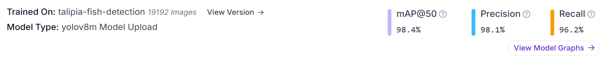
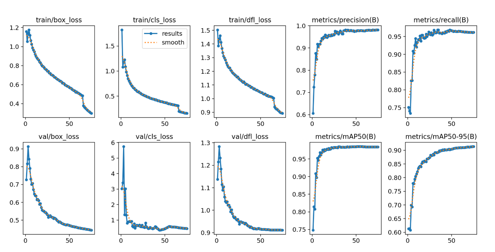
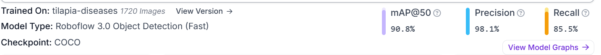
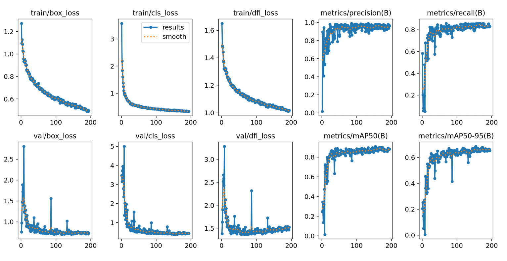
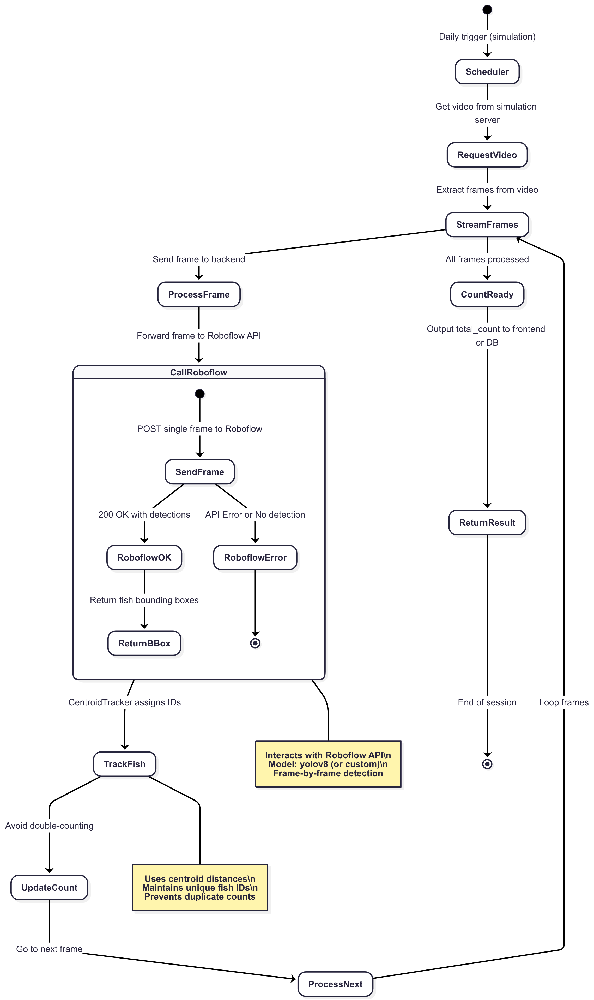
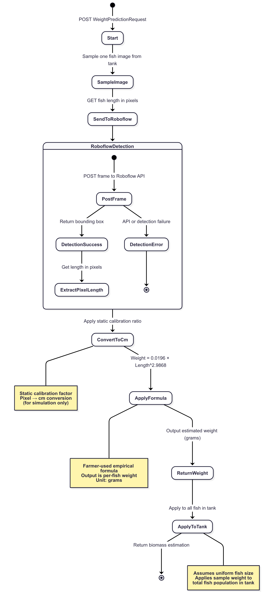
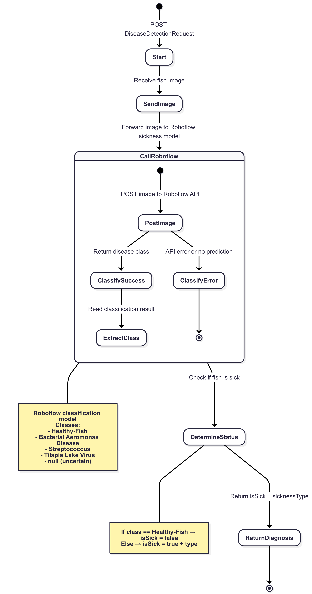
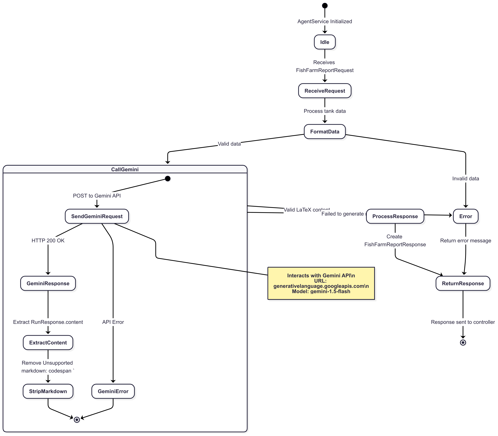

# 🐟 FIRMATECH-BACKEND-AI

Smart aquaculture AI backend built with **FastAPI** — enabling fish counting, disease detection, biomass estimation, and more. Designed for real-world farm automation with modular service architecture and AI integration.

---

## 📁 Table of Contents

* [Features](#features)
* [Architecture](#architecture)
* [AI Models & Evaluation](#ai-models--evaluation)
* [Endpoints Overview](#endpoints-overview)
* [Project Structure](#project-structure)
* [Getting Started](#getting-started)
* [Environment Setup](#environment-setup)
* [Future Work](#future-work)
* [License](#license)

---

## ✅ Features

| Module               | Description                                                          |
| -------------------- | -------------------------------------------------------------------- |
| 🎥 Fish Counting     | Real-time video-based fish counting using YOLOv8 + Centroid Tracking |
| ⚖️ Weight Estimation | Biomass calculation via length-based prediction formula              |
| 🩺 Disease Detection | Classify fish sickness from image (e.g., Aeromonas, Tilapia Virus)   |
| 🧪 Farm Monitoring   | Generate natural language reports from sensor data using Gemini API  |
| 🍽️ Food Prediction  | *(Planned)* Predict fish feeding needs based on AI heuristics        |

---

## 🧱 Architecture

```
FastAPI
🔼 Routers (API Endpoints)
🔼 Controllers (Logic Handlers)
🔼 Modules (Pydantic Schemas)
🔼 Services (Roboflow / Agent)
🔼 Utils (Tracking, Math utils)
```

> Uses **Roboflow** for AI inference and **Gemini Pro** for report generation.

---

## 📊 AI Models & Evaluation

### 🤖 1. Fish Detection & Counting (YOLOv8)

* **Model**: Custom YOLOv8m (Roboflow)
* **Input**: Video frames
* **Output**: Bounding boxes of detected fish
* **Post-processing**: `CentroidTracker` avoids double counting




### 🧬 2. Disease Classification

* **Model**: Roboflow classification model
* **Classes**:
  * `Healthy-Fish`
  * `Tilapia Lake Virus`
  * `Bacterial Aeromonas Disease`
  * `Streptococcus`
  * `null` (uncertain)

```json
{
  "isSick": true,
  "sicknessType": "Streptococcus"
}
```




### ⚖️ 3. Weight Prediction

* **Formula**:

  ```
  Weight (g) = 0.0196 × Length(cm)^2.9868
  ```
* **Calibration**: Static for testing (pixel → cm)
* **Assumption**: Sampled fish weight is applied to whole tank


---

## 📱 Endpoints Overview

| Route               | Method | Description                     |
| ------------------- | ------ | ------------------------------- |
| `/fish-count`       | POST   | Real-time fish count from video |
| `/weight`           | POST   | Predict fish weight             |
| `/disease`          | POST   | Detect fish sickness            |
| `/fish-farm/report` | POST   | Generate sensor-based report    |
| `/food`             | 🔒     | *(Planned)* Food AI estimation  |

---

## 🧠 Diagram Snapshots

### Fish Counting


### Weight Prediction


### Disease Detection


### Daily report generation


---

## 📁 Project Structure

```
FIRMATECH-BACKEND-AI/
👉 main.py                 # App entry
👉 controllers/            # Endpoint logic
👉 routers/                # FastAPI route definitions
👉 modules/                # Schemas and models
👉 services/               # Agent/Roboflow integrations
👉 utils/                  # Tracking, calibration
👉 diagram/                # Diagrams
👉 Dockerfile, docker-compose.yml
👉 .env, .env.example
👉 requirements.txt
```

---

## 🚀 Getting Started

### 🔧 Local (Python)

```bash
git clone https://github.com/your-username/FIRMATECH-BACKEND-AI.git
cd FIRMATECH-BACKEND-AI
python -m venv venv
source venv/bin/activate   # or venv\Scripts\activate on Windows
pip install -r requirements.txt
uvicorn main:app --reload
```

### 🐳 Docker (Recommended)

```bash
docker-compose up --build
```

---

## ⚙️ Environment Setup

Copy `.env.example` to `.env` and set values:

```env
ROBOFLOW_API_URL=your_key
ROBOFLOW_API_KEY=your_model_url
ROBOFLOW_DETECTION_MODEL_ID=your_model_url
ROBOFLOW_DISEASES_MODEL_ID=your_model_url
GOOGLE_API_KEY=your_gemini_key
```

---

## 🔬 Future Work

* Improve fish length estimation using adaptive calibration and pixel-to-cm mapping
* Enhance prediction accuracy with multi-angle sampling or better lighting
* Expand the dataset for disease detection across seasons
